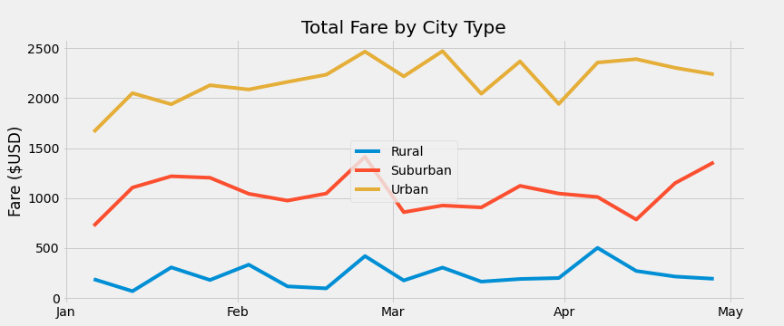
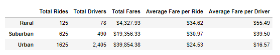

# PyBer_Analysis

## Project Overview
The purpose of the new analysis was to create a summary of the ride-sharing data by city type: Urban, Suburban, Rural.
The current analysis focuses on the total amount of fares earned per week by all drivers in each city type. 

## Resources
Data Sources: city_data.csv, ride_data.csv
Software: Python 3.7.6, Visual Studio Code 1.53.2

## Summary

The results of the analysis are depicted in the following plot and table:

The analysis shows that 

1) The revenue by city type increases in the order

